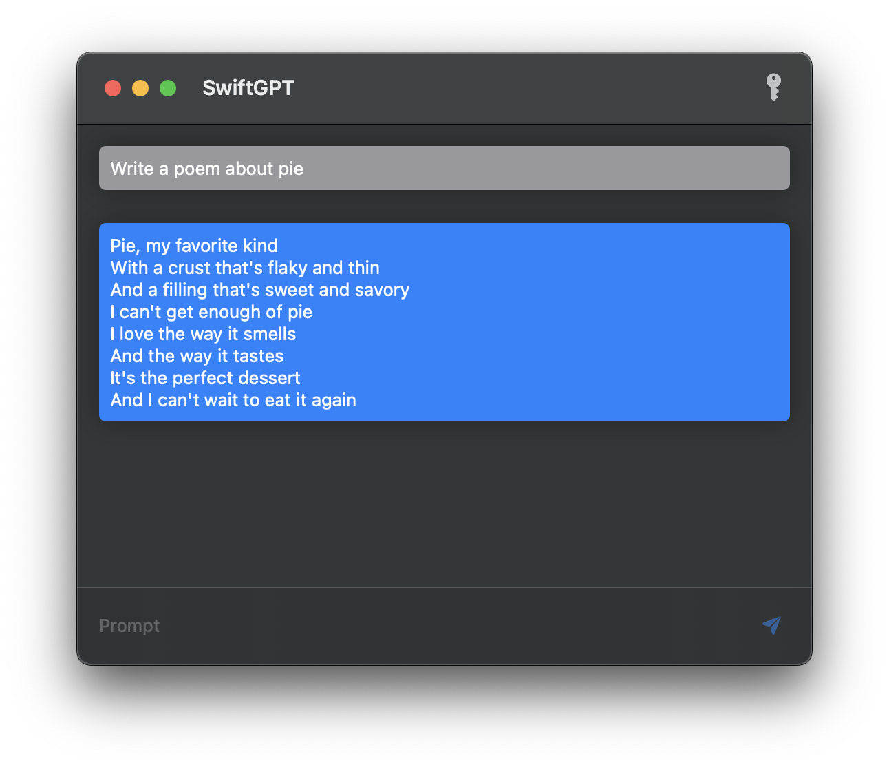

#  SwiftGPT

## About

### Story

As an exercise in native macOS development, build an app using the OpenAI API in Swift and SwiftUI. This app should:

1. Allow an end user to enter their OpenAI API key ✅
2. Take in a text prompt ✅
3. Query the OpenAI API ✅
4. Display the result in a list view alongside the user's prompt ✅
5. Retain the user's API key after quitting ✅

### Stretch Features

1. Store chat history between sessions
2. Allow user to select which OpenAI engine they'd like to use (currently defaults to "curie")

## Installation & Usage

1. Download the latest build [here](https://github.com/ghall89/swiftgpt/releases).
2. The first time you run the app, right click on the app icon and select open. Follow the instrcutions on the dialog.
3. If you don't already have an API key for OpenAI, create a developer account and generate a key at https://platform.openai.com.
4. Click the key button on the top right of the window, enter your API key, and click “Ok"
5. Enter your prompt, and either click “Send” or press the return key

## Questions

Please direct any feedback or questions to me [on Mastodon](https://home.social/@ghalldev)!
